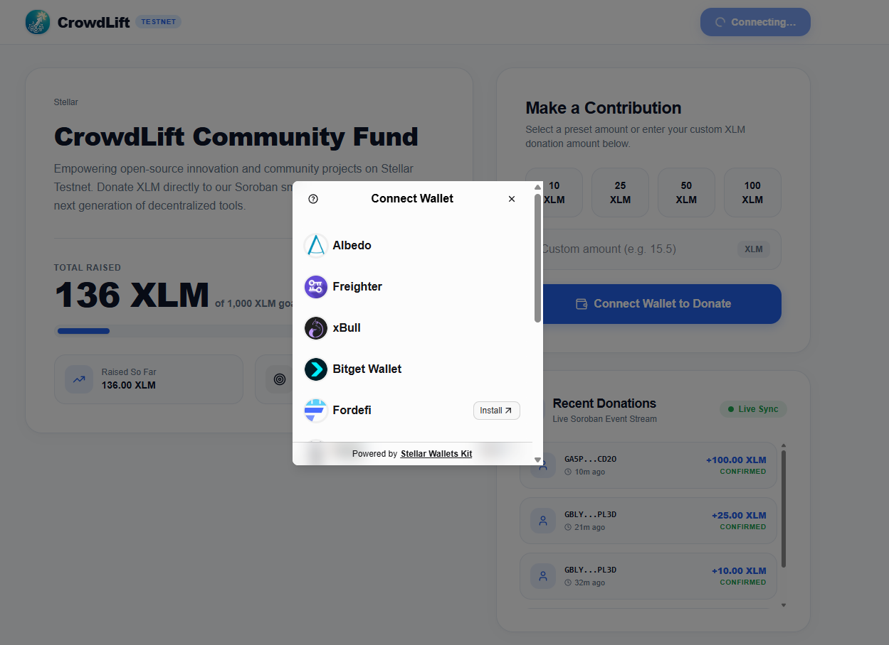

# CrowdLift — Stellar Testnet Crowdfunding dApp

<p align="center">
  <strong>A decentralized crowdfunding platform built on Stellar Testnet with Soroban smart contracts.</strong><br />
  Donate XLM directly to on-chain campaigns through any Stellar wallet.
</p>

<p align="center">
  <a href="https://crowdlift.vercel.app/">🌐 Live Demo</a> •
  <a href="https://stellar.expert/explorer/testnet/contract/CCJKTTNZGUKVKH2M3WXKGAW2IKOK3VPI553D2SA2KPI4FV2Z6DNJ4K7G">📜 Contract on Stellar Expert</a> •
  <a href="https://stellar.expert/explorer/testnet/tx/4f7b6087e2f633239a6602ce57cfe429f13d99391be5c2f4178bfc3721e0f40d">🔗 Verified Transaction</a>
</p>

---

## 🖼️ Wallet Options Screenshot

The app supports **all major Stellar wallets** through [StellarWalletsKit](https://stellarwalletskit.dev/). The built-in auth modal presents every compatible wallet option:



---

## 📋 Submission Checklist

| Requirement                          | Details                                                                                                                                                                                                      |
| ------------------------------------ | ------------------------------------------------------------------------------------------------------------------------------------------------------------------------------------------------------------ |
| **Live Demo**                        | [https://crowdlift.vercel.app/](https://crowdlift.vercel.app/)                                                                                                                                               |
| **Wallet Options Screenshot**        | [`public/wallet_option.png`](public/wallet_option.png) — see above                                                                                                                                           |
| **Deployed Contract Address**        | `CCJKTTNZGUKVKH2M3WXKGAW2IKOK3VPI553D2SA2KPI4FV2Z6DNJ4K7G` — [View on Stellar Expert](https://stellar.expert/explorer/testnet/contract/CCJKTTNZGUKVKH2M3WXKGAW2IKOK3VPI553D2SA2KPI4FV2Z6DNJ4K7G)             |
| **Transaction Hash (Contract Call)** | `4f7b6087e2f633239a6602ce57cfe429f13d99391be5c2f4178bfc3721e0f40d` — [Verify on Stellar Expert](https://stellar.expert/explorer/testnet/tx/4f7b6087e2f633239a6602ce57cfe429f13d99391be5c2f4178bfc3721e0f40d) |
| **README with Setup Instructions**   | This file ✅                                                                                                                                                                                                 |

---

## ✨ Features

- **Multi-Wallet Support** — Connect via Freighter, xBull, Albedo, Lobstr, Rabet, Hana, and more through [StellarWalletsKit](https://stellarwalletskit.dev/) `defaultModules()`.
- **Soroban Smart Contract** — Fully on-chain crowdfunding logic written in Rust, deployed to Stellar Testnet.
- **Real XLM Transfers** — Donations transfer native XLM from the donor's wallet to the campaign admin via Soroban token client.
- **Live Event Stream** — Real-time donation feed powered by Soroban contract events polled from the Stellar RPC.
- **Session Persistence** — Wallet auto-reconnects on page refresh via localStorage.
- **Toast Notifications** — Floating toast system for transaction success, errors, and wallet state changes.
- **Progress Tracking** — Live campaign progress bar, goal tracking, and individual donor contribution display.
- **Responsive 2-Column Layout** — Campaign details and donation form visible side-by-side above the fold.

---

## 🛠️ Tech Stack

| Layer              | Technology                                                            |
| ------------------ | --------------------------------------------------------------------- |
| **Frontend**       | [Next.js 16](https://nextjs.org/) (App Router), React 19, TypeScript  |
| **Styling**        | [Tailwind CSS v4](https://tailwindcss.com/)                           |
| **Wallet**         | [StellarWalletsKit v2.5](https://stellarwalletskit.dev/)              |
| **Blockchain**     | [Stellar SDK v16](https://www.npmjs.com/package/@stellar/stellar-sdk) |
| **Smart Contract** | Soroban (Rust) — `soroban-sdk 22.0.6`                                 |
| **Icons**          | [Lucide React](https://lucide.dev/)                                   |
| **Network**        | Stellar Testnet                                                       |

---

## 🚀 Getting Started

### Prerequisites

- **Node.js** ≥ 18
- **Rust** + `wasm32-unknown-unknown` target (for smart contract development)
- **Stellar CLI** (`stellar`) — [Install Guide](https://soroban.stellar.org/docs/getting-started/setup)
- A **Stellar wallet browser extension** (e.g., [Freighter](https://www.freighter.app/))

### 1. Clone the Repository

```bash
git clone https://github.com/ianpurif/crowdlift.git
cd crowdlift
```

### 2. Install Dependencies

```bash
npm install
```

### 3. Environment Configuration

Copy the example environment file and update values if needed:

```bash
cp .env.local.example .env.local
```

Default values (already configured for Stellar Testnet):

```env
NEXT_PUBLIC_CONTRACT_ID=CCJKTTNZGUKVKH2M3WXKGAW2IKOK3VPI553D2SA2KPI4FV2Z6DNJ4K7G
NEXT_PUBLIC_SOROBAN_RPC_URL=https://soroban-testnet.stellar.org
NEXT_PUBLIC_HORIZON_URL=https://horizon-testnet.stellar.org
NEXT_PUBLIC_NETWORK_PASSPHRASE=Test SDF Network ; September 2015
```

### 4. Run the Development Server

```bash
npm run dev
```

Open [http://localhost:3000](http://localhost:3000) in your browser.

### 5. Build for Production

```bash
npm run build
npm start
```

---

## 📜 Smart Contract

The Soroban smart contract is located in [`contracts/crowdfund/src/lib.rs`](contracts/crowdfund/src/lib.rs).

### Contract Functions

| Function           | Description                                                 |
| ------------------ | ----------------------------------------------------------- |
| `initialize`       | Set admin, fundraising goal (stroops), and token address    |
| `donate`           | Transfer XLM from donor to admin, update totals, emit event |
| `get_goal`         | Read the campaign funding goal                              |
| `get_total_raised` | Read total XLM raised on-chain                              |
| `get_contribution` | Read a specific donor's cumulative contribution             |

### Build & Deploy the Contract

```bash
# 1. Build the WASM binary
cd contracts/crowdfund
cargo build --target wasm32-unknown-unknown --release

# 2. Create a deployer identity (one-time)
stellar keys generate crowdlift-deployer --network testnet --fund

# 3. Deploy
stellar contract deploy \
  --wasm target/wasm32-unknown-unknown/release/crowdfund.wasm \
  --network testnet \
  --source crowdlift-deployer

# 4. Initialize (replace CONTRACT_ID and ADMIN_ADDRESS)
stellar contract invoke \
  --id <CONTRACT_ID> \
  --network testnet \
  --source crowdlift-deployer \
  -- initialize \
  --admin <ADMIN_ADDRESS> \
  --goal 10000000000 \
  --token CDLZFC3SYJYDZT7K67VZ75HPJVIEUVNIXF47ZG2FB2RMQQVU2HHGCYSC
```

> **Note:** `CDLZFC3SYJYDZT7K67VZ75HPJVIEUVNIXF47ZG2FB2RMQQVU2HHGCYSC` is the Stellar Testnet Native XLM Token (SAC) contract address.

### Run Contract Tests

```bash
cd contracts/crowdfund
cargo test
```

---

## 📁 Project Structure

```
crowdlift/
├── contracts/crowdfund/         # Soroban smart contract (Rust)
│   ├── src/lib.rs               # Contract logic
│   └── Cargo.toml               # Rust dependencies
├── public/
│   ├── icon.png                 # App logo / favicon source
│   └── wallet_option.png        # Wallet options screenshot
├── src/
│   ├── app/
│   │   ├── globals.css          # Global styles & Tailwind
│   │   ├── layout.tsx           # Root layout with metadata
│   │   ├── page.tsx             # Main campaign page
│   │   ├── providers.tsx        # Toast + Wallet providers
│   │   └── icon.png             # App Router favicon
│   ├── components/
│   │   ├── ActivityFeed.tsx     # Live donation event stream
│   │   ├── CampaignCard.tsx     # Campaign hero card
│   │   ├── DonationForm.tsx     # Donation input + validation
│   │   ├── TransactionStatus.tsx # Transaction status display
│   │   └── WalletButton.tsx     # Wallet connect/switch/disconnect
│   ├── contexts/
│   │   ├── ToastContext.tsx      # Toast notification system
│   │   └── WalletContext.tsx     # Wallet state management
│   ├── lib/
│   │   ├── contract.ts          # Soroban contract interaction
│   │   ├── stellar.ts           # Stellar helpers (balance, utils)
│   │   └── wallet.ts            # StellarWalletsKit initialization
│   └── types/
│       └── index.ts             # TypeScript type definitions
├── .env.local.example           # Environment template
├── package.json
├── tsconfig.json
└── next.config.ts
```

---

## 🔗 Verified On-Chain Data

- **Contract Address:** [`CCJKTTNZGUKVKH2M3WXKGAW2IKOK3VPI553D2SA2KPI4FV2Z6DNJ4K7G`](https://stellar.expert/explorer/testnet/contract/CCJKTTNZGUKVKH2M3WXKGAW2IKOK3VPI553D2SA2KPI4FV2Z6DNJ4K7G)
- **Transaction Hash:** [`4f7b6087e2f633239a6602ce57cfe429f13d99391be5c2f4178bfc3721e0f40d`](https://stellar.expert/explorer/testnet/tx/4f7b6087e2f633239a6602ce57cfe429f13d99391be5c2f4178bfc3721e0f40d)
- **Network:** Stellar Testnet (`Test SDF Network ; September 2015`)

---

## 📄 License

MIT © 2026 CrowdLift Technologies
