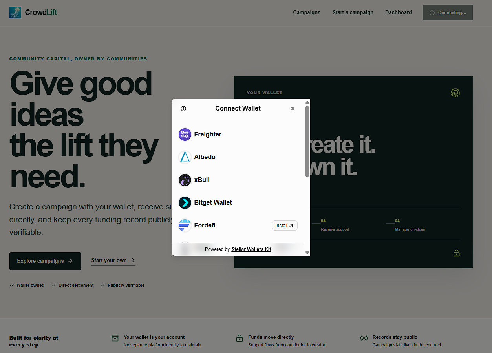

<p align="center">
  
</p>

# CrowdLift

CrowdLift is a decentralized crowdfunding application built on Stellar. Creators use their connected wallet to publish and manage campaigns. Supporters send funds directly to the creator wallet.

<p align="center">
  <a href="https://crowdlift.vercel.app/">Live Demo</a> ·
  <a href="https://stellar.expert/explorer/testnet/contract/CC5TW6SNJVV7FQ2FMDCWW2Y2AW66AK564QBLCMUZLLSV3NHWSEYHM6YK">Smart Contract</a> ·
  <a href="https://stellar.expert/explorer/testnet/tx/5c5e15276bc1f1ca3fc0e97b33dc6cdab7fe82463e29fa4cd344d928fc1e182a">Verified Contract Call</a>
</p>

## Submission Links

| Requirement | Verified information |
| --- | --- |
| Live demo | [https://crowdlift.vercel.app/](https://crowdlift.vercel.app/) |
| Wallet options screenshot | [View image](public/wallet-options-available.png) |
| Deployed smart contract | [`CC5TW6SNJVV7FQ2FMDCWW2Y2AW66AK564QBLCMUZLLSV3NHWSEYHM6YK`](https://stellar.expert/explorer/testnet/contract/CC5TW6SNJVV7FQ2FMDCWW2Y2AW66AK564QBLCMUZLLSV3NHWSEYHM6YK) |
| Successful contract call | [`5c5e15276bc1f1ca3fc0e97b33dc6cdab7fe82463e29fa4cd344d928fc1e182a`](https://stellar.expert/explorer/testnet/tx/5c5e15276bc1f1ca3fc0e97b33dc6cdab7fe82463e29fa4cd344d928fc1e182a) |

The transaction above is a successful `create_campaign` call for the deployed campaign registry contract.

## Available Wallet Options

CrowdLift uses Stellar Wallets Kit. Users can choose from the wallets available in the connection modal.



## Main Features

- Create a campaign with a connected wallet.
- Use the wallet address as the campaign owner identity.
- Discover campaigns on a separate campaigns page.
- Send contributions directly to the creator wallet.
- Manage owned campaigns from the wallet dashboard.
- Update, pause, or reopen a campaign with owner authorization.
- Review campaign activity and verify transactions on the blockchain explorer.
- Continue using the original single-campaign contract through the legacy campaign route.

## How It Works

1. A creator connects a Stellar wallet.
2. The creator publishes campaign details to the registry contract.
3. The creator wallet becomes the campaign owner and management key.
4. A supporter approves a contribution in their wallet.
5. The contract transfers the contribution directly to the creator.
6. Contract events appear in the campaign Activity History.

CrowdLift does not use an application database, custodial balance, or privileged platform administrator. Campaign ownership, campaign state, contribution totals, and activity records come from Stellar contracts.

## Smart Contracts

### Campaign Registry

Address:

```text
CC5TW6SNJVV7FQ2FMDCWW2Y2AW66AK564QBLCMUZLLSV3NHWSEYHM6YK
```

Main functions:

- `create_campaign`
- `update_campaign`
- `set_active`
- `contribute`
- `get_campaign`
- `list_campaigns`
- `get_creator_campaigns`
- `get_contribution`

### Supporting Contracts

- Native asset token: `CDLZFC3SYJYDZT7K67VZ75HPJVIEUVNIXF47ZG2FB2RMQQVU2HHGCYSC`
- Legacy campaign: `CCJKTTNZGUKVKH2M3WXKGAW2IKOK3VPI553D2SA2KPI4FV2Z6DNJ4K7G`

The legacy contract remains available so existing campaign data and contribution behavior continue to work.

## Application Routes

| Route | Purpose |
| --- | --- |
| `/` | Product overview |
| `/campaigns` | Campaign discovery |
| `/campaigns/new` | Campaign creation |
| `/campaigns/[id]` | Campaign details, contributions, and activity history |
| `/dashboard` | Wallet-owned campaigns |
| `/dashboard/campaigns/[id]` | Owner campaign controls |

## Technology

- Next.js 16 and React 19
- TypeScript
- Stellar SDK
- Stellar Wallets Kit
- Soroban smart contracts written in Rust
- XLM through the native Stellar asset contract

## Local Development

Requirements:

- Node.js 20 or newer
- npm
- Rust
- Stellar CLI
- Rust target `wasm32v1-none`

Install and start the application:

```bash
npm install
cp .env.local.example .env.local
npm run dev
```

On Windows PowerShell, copy the environment file with:

```powershell
Copy-Item .env.local.example .env.local
```

Public environment variables:

```text
NEXT_PUBLIC_CONTRACT_ID
NEXT_PUBLIC_CAMPAIGN_REGISTRY_ID
NEXT_PUBLIC_NATIVE_TOKEN_CONTRACT_ID
NEXT_PUBLIC_SOROBAN_RPC_URL
NEXT_PUBLIC_HORIZON_URL
NEXT_PUBLIC_NETWORK_PASSPHRASE
```

## Verification

Run the application checks:

```bash
npm run lint
npm run build
cargo test --manifest-path contracts/campaign_registry/Cargo.toml
stellar contract build --manifest-path contracts/campaign_registry/Cargo.toml --locked
```
